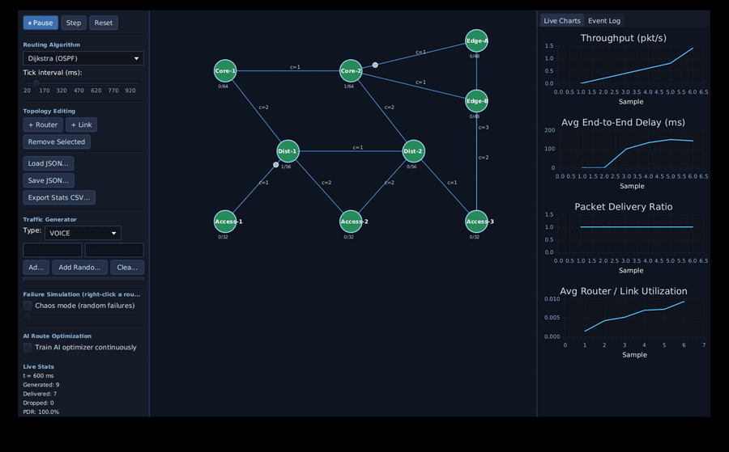
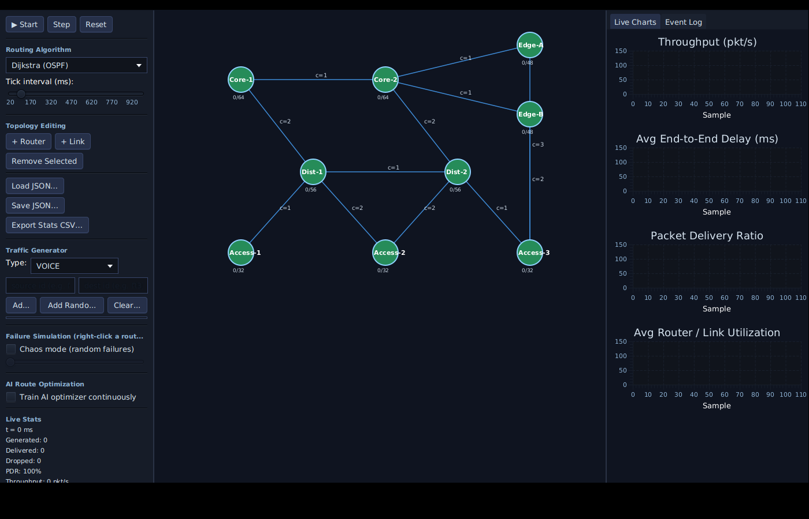
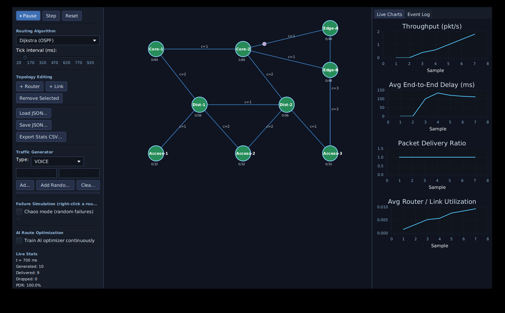
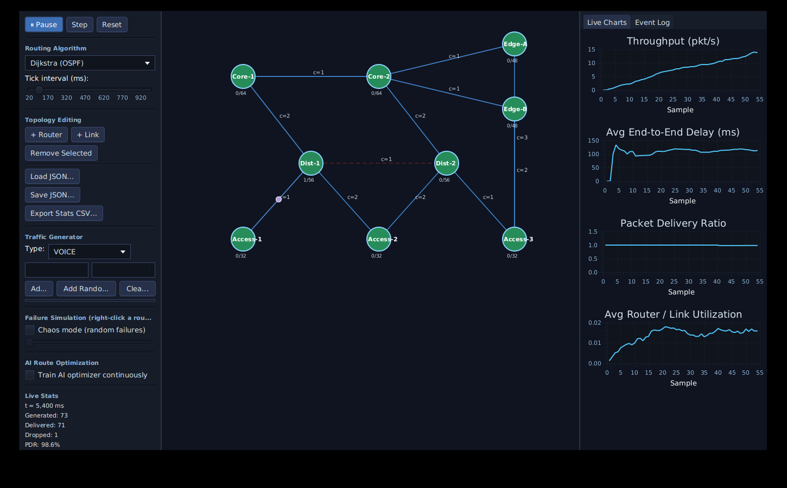
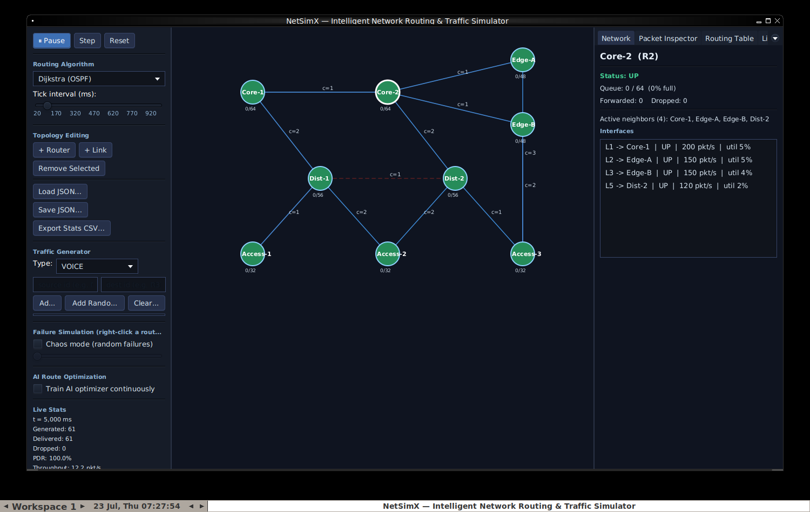
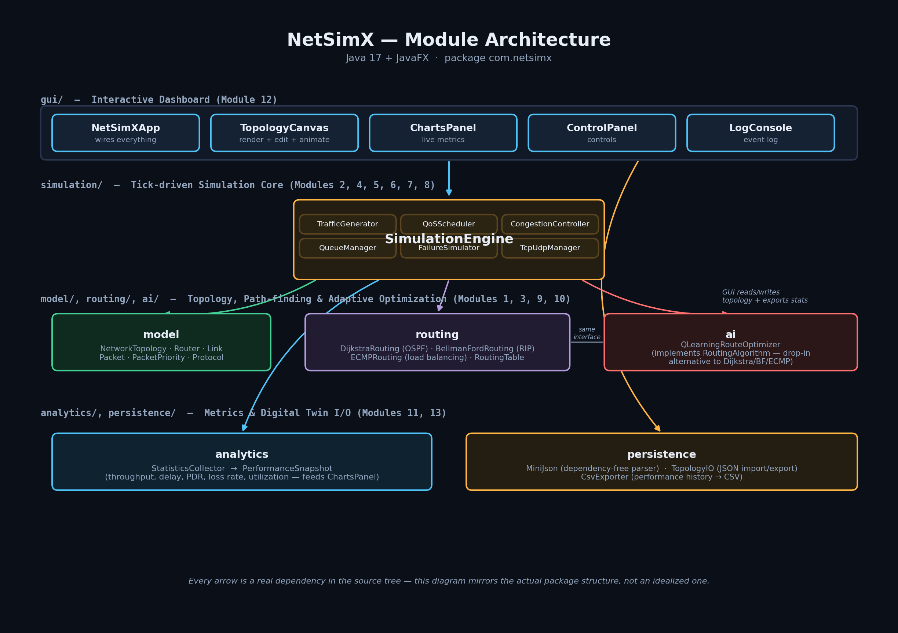

<div align="center">


**A Java 17 + JavaFX simulator that models real computer networks** — routers,
links, packet-by-packet forwarding, congestion, QoS scheduling, TCP/UDP
behavior, link/router failures, live performance analytics, and an adaptive
AI route optimizer, all visualized in an interactive dashboard.

<!-- Replace OWNER/REPO below once this is pushed to your own GitHub repo -->
[](https://github.com/OWNER/REPO/actions/workflows/ci.yml)




*Live capture: traffic flowing across a 9-router topology, a link failing mid-run, and the routing engine rerouting around it — recorded straight from the running app.*

</div>

---

## Quick start

```bash
mvn javafx:run      # launch the dashboard (fetches JavaFX from Maven Central on first run)
mvn test             # run the JUnit 5 test suite (38 tests)
mvn package          # build a distributable fat jar at target/netsimx.jar
java -jar target/netsimx.jar
```

Requires **JDK 17+** and an internet connection on first build (Maven needs
to download JavaFX and JUnit from Maven Central — everything else in this
project is dependency-free, see [Design notes](#design-notes)).

On launch, NetSimX loads `config/sample-network.json` (a 9-router, 3-tier
campus-style topology) if it's found in the working directory; otherwise it
falls back to a small built-in 4-router demo topology, so the app never
fails to start.

## Screenshots

<table>
<tr>
<td width="25%"><br/><sub><b>Fresh load</b> — 9-router topology, paused</sub></td>
<td width="25%"><br/><sub><b>Running</b> — traffic flowing, charts live</sub></td>
<td width="25%"><br/><sub><b>Failure</b> — link down (red dashed), auto-reroute</sub></td>
<td width="25%"><br/><sub><b>Inspector</b> — live router/interface detail on click</sub></td>
</tr>
</table>

## Architecture



This mirrors the real package structure — every box is an actual Java
package, every arrow a real dependency between them, not an idealized
diagram. See [Project layout](#project-layout) below for the file-level
breakdown.

## What's implemented

| # | Module (from the design doc) | Where |
|---|---|---|
| 1 | Network Topology Builder | `model.NetworkTopology`, `gui.TopologyCanvas` (drag routers, click-add router/link, right-click context menu) |
| 2 | Packet Simulation Engine | `model.Packet`, `simulation.PacketGenerator`, `simulation.SimulationEngine`, `gui.PacketInspectorPanel` (click any in-flight packet for live detail) |
| 3 | Routing Engine | `routing.DijkstraRouting`, `routing.BellmanFordRouting`, `routing.ECMPRouting`, `routing.RoutingTable`, `gui.RoutingTablePanel` (live per-router routing table view) |
| 4 | Congestion & Queue Management | `simulation.QueueManager`, `simulation.CongestionController`, bounded queues on `model.Router`, `Link.congest()`/`releaseCongestion()` (manual congestion injection via context menu) |
| 5 | Traffic Generator | `simulation.TrafficGenerator` (Voice/Video/Web/Email/File Transfer profiles) |
| 6 | Quality of Service (QoS) | `simulation.QoSScheduler` (strict priority scheduling) |
| 7 | Network Failure Simulation | `simulation.FailureSimulator` (manual + chaos-mode random failures, auto-reroute) |
| 8 | TCP & UDP Communication | `simulation.TcpUdpManager` (ACK/retransmit/timeout vs fire-and-forget) |
| 9 | Load Balancing (ECMP) | `routing.ECMPRouting` (per-packet path selection across equal-cost routes) |
| 10 | AI-Based Route Optimization | `ai.QLearningRouteOptimizer` (see note below) |
| 11 | Performance Analytics | `analytics.StatisticsCollector`, `analytics.PerformanceSnapshot` |
| 12 | Interactive Dashboard | `gui.NetSimXApp`, `gui.TopologyCanvas`, `gui.ChartsPanel`, `gui.ControlPanel`, `gui.LogConsole`, `gui.NetworkPanel`, `gui.PacketInspectorPanel`, `gui.RoutingTablePanel` |
| 13 | Digital Twin Support | `persistence.TopologyIO` (JSON import/export), `config/sample-network.json` |

## Design notes

**AI route optimizer is pure Java, not Python/Stable-Baselines3.** The
original design doc listed Python + Stable-Baselines3 as an optional
external RL component. This build couldn't reach PyPI or a Python RL stack
in a way that would cleanly integrate with a JavaFX desktop app, so
`ai.QLearningRouteOptimizer` implements a real (if intentionally
lightweight) tabular Q-learning agent directly in Java — no external
service, no stub. It learns a state/action table keyed on
`(currentRouter, destination)` and adapts its routing decisions to live
congestion (queue occupancy) and link utilization, using an actual
Bellman-equation update with epsilon-greedy exploration. It implements the
same `RoutingAlgorithm` interface as Dijkstra/Bellman-Ford/ECMP, so it's a
drop-in, selectable option in the dashboard's algorithm dropdown, and you
can toggle "Train AI optimizer continuously" to watch it adapt in real
time. Swapping in an external Python/Stable-Baselines3 service later would
mean replacing this one class with an HTTP/gRPC client while keeping the
same interface — nothing else in the app would need to change.

**No SQLite dependency.** The design doc's tech stack mentions SQLite for
persistence. To keep the project's only external dependencies as JavaFX
(+ JUnit for tests), topology import/export uses a small hand-rolled JSON
reader/writer (`persistence.MiniJson`) instead of a JSON library, and
performance history exports to CSV (`persistence.CsvExporter`) instead of
a database — both are genuinely useful (JSON topologies are
portable/diffable; CSV opens directly in Excel/pandas) and avoid pulling
in a JDBC driver for what is, in this simulator, fundamentally
append-only time-series data. If you want actual SQLite-backed
persistence, add `org.xerial:sqlite-jdbc` to `pom.xml` and swap
`CsvExporter` for a small JDBC writer — `StatisticsCollector`'s
`PerformanceSnapshot` objects already have everything a row needs.

## Inspector panels & context menus

Beyond the topology view, the right-side tab panel has three live inspectors:

- **Network** — click any router to see its status, queue occupancy,
  cumulative forwarded/dropped counts, active neighbors, and per-interface
  detail (bandwidth, up/down state, utilization, congestion flag).
- **Packet Inspector** — click any moving packet dot on the canvas to see
  its live source/destination/protocol/TTL/size/priority/current
  router/delay/state/checksum. Holds a direct reference to the packet
  object, so the panel keeps updating in real time for as long as it's in
  flight, then freezes on its final state once delivered or dropped.
- **Routing Table** — click a router to see its complete live routing
  table (destination, next hop, metric, hop count) from whichever
  algorithm is currently active.

**Right-click a router** for: Inspect, Routing Table, Disable/Enable,
Generate Traffic From Here, Rename, Delete.

**Right-click a link** for: Bandwidth, Latency, and Packet Loss % (each
opens an editable dialog), Disable/Enable, Congest Link / Release
Congestion, Delete. Packet Loss % is a genuine per-hop drop probability
independent of congestion (`Link.lossProbability`) — a way to simulate
line noise/bit errors separately from buffer overflow. Congest Link cuts
a link's bandwidth to 10% of normal (remembering the original value so
Release Congestion can restore it exactly) — a quick way to manually
trigger visible queueing/backpressure for a demo without waiting for
organic traffic to build it up.

## App navigation & workflow

NetSimX now opens into a proper app shell instead of dropping you straight
into a topology:

**Splash Screen** → **New Simulation** (topology template + algorithm +
traffic preset wizard), **Open Project** (load a saved JSON topology),
**Benchmark Mode**, or **Documentation**.

**New Simulation Wizard** — pick a topology template (Empty, Star, Mesh,
Ring, Tree, or the same ISP Backbone shape as the bundled sample), a
starting routing algorithm, and a traffic preset (Random Mixed,
Video-Heavy, Voice-Heavy, HTTP/Web-Heavy), then **Create** drops you
straight into a live workspace with a few starter flows already running.

**Home Dashboard** — reachable via the workspace's new **🏠 Home** button:
recent projects (persisted to `~/.netsimx/recent-projects.json` across
restarts), and quick actions for a new simulation, importing JSON,
benchmarking, or browsing the bundled sample topology library
(`config/samples/` — Campus LAN, Enterprise Network, Data Center, ISP
Backbone, Smart City IoT).

Every one of these paths (wizard, open project, open sample, recent
project, demo mode) funnels through a single `enterWorkspace()` entry
point, so "New Simulation" from the dashboard genuinely rebuilds a fresh
engine/canvas/UI rather than reusing stale state from whatever you had
open before.

## Benchmark Mode & Reports

**Benchmark Mode** (workspace's **📊 Benchmark** button, or from the
splash/dashboard) runs each selected routing algorithm N independent
times over an identical topology and traffic scenario, headlessly (no
GUI ticking, no wall-clock pacing - just `engine.tick()` back-to-back on
a background thread so the UI stays responsive), then aggregates the
results into a comparison table and bar chart. Each run gets a **fresh**
topology and engine instance, which matters most for the AI optimizer:
its Q-table starts cold every run for a fair comparison against the
static algorithms, rather than quietly accumulating an unfair advantage
across runs.

We swapped the design doc's "CPU / Memory" comparison columns for
**Avg Utilization** and **Delivered/Dropped counts** instead — this is a
packet-level network simulator, not a process profiler, so CPU/memory
numbers wouldn't correspond to anything the engine actually measures.
Avg delay, loss rate, and throughput are still exactly what's described.

**Report Screen** (workspace's **📄 Report** button) — a live summary
pulled directly from the running `SimulationEngine` (topology, algorithm,
simulation time, packets generated/delivered, loss rate, average delay,
bandwidth utilization, congestion events, failures triggered, TCP
retransmissions, and AI training steps if the AI optimizer is active),
with **Download CSV** (performance history) and **Download PDF** buttons.
The PDF is generated by a small hand-rolled writer
(`persistence.MiniPdf`) — valid PDF 1.4 with proper pagination once
content overflows a page — rather than pulling in a PDF library, keeping
with the project's dependency-free persistence approach. Verified with
`pdftotext` during development: correct text extraction, correct escaping
of special characters, and correct page breaks.

"Congestion Events" counts distinct episodes (not-congested to
congested transitions), not every tick spent congested — a 50-tick
traffic jam reads as 1 event, not 50.

## Using the dashboard

- **Start / Pause / Step / Reset** — top-left controls. Step lets you
  advance one tick at a time while paused, useful for watching routing
  decisions closely.
- **Routing Algorithm dropdown** — switch live between Dijkstra,
  Bellman-Ford, ECMP, and the AI optimizer. Routes recompute immediately.
- **Tick interval slider** — controls simulated time per tick (20–1000ms);
  lower = faster simulation.
- **Topology editing** — toggle "+ Router" and click empty canvas space to
  add a router; toggle "+ Link" and click two routers in sequence to
  connect them; click a router or link then "Remove Selected" to delete
  it. Drag routers to reposition them.
- **Right-click a router or link** to toggle it up/down — this is the
  quickest way to test rerouting after a failure (Module 7), and it's
  exactly what the GIF above shows.
- **Traffic Generator panel** — add a flow by router ID + traffic type, or
  click "Add Random Flow" to wire up two random active routers. Flows keep
  generating packets every tick per their configured rate.
- **Chaos mode** — check the box and drag the slider to have the
  simulator randomly fail links on its own, for unattended resilience
  testing.
- **Load JSON / Save JSON** — import/export the current topology using
  the format in `config/sample-network.json`.
- **Export Stats CSV** — dump the full performance history collected so
  far for offline analysis.
- **Live Charts / Event Log tabs** (right side) — throughput, delay, PDR,
  and utilization update every tick; the log records drops, retransmits,
  failures, and recoveries as they happen.

## Project layout

```
netsimx/
├── pom.xml
├── .github/workflows/ci.yml     # GitHub Actions: build + test on JDK 17 & 21
├── config/
│   ├── sample-network.json      # 9-router demo topology loaded on startup (demo mode)
│   └── samples/                 # sample topology library for the wizard/dashboard
│       ├── campus-lan.json
│       ├── enterprise-network.json
│       ├── data-center.json
│       ├── isp-backbone.json
│       └── smart-city-iot.json
├── docs/
│   ├── screenshot.png
│   └── assets/                  # logo, GIF, gallery screenshots, architecture diagram
└── src/
    ├── main/java/com/netsimx/
    │   ├── model/                # Router, Link, Packet, NetworkTopology, enums
    │   ├── routing/               # Dijkstra, Bellman-Ford, ECMP, RoutingTable
    │   ├── simulation/            # SimulationEngine, BenchmarkRunner, all Module 2/4/5/6/7/8 logic
    │   ├── ai/                    # Q-learning route optimizer
    │   ├── analytics/             # StatisticsCollector, PerformanceSnapshot
    │   ├── topology/               # TopologyGenerator (Star/Mesh/Ring/Tree/ISP Backbone templates)
    │   ├── persistence/           # MiniJson, TopologyIO, CsvExporter, MiniPdf, RecentProjects
    │   └── gui/                   # NetSimXApp, Splash/Dashboard/Wizard/Benchmark/Report screens, workspace UI
    ├── main/resources/com/netsimx/gui/
    │   ├── dashboard.css
    │   ├── logo-wordmark.png
    │   └── logo-icon.png
    └── test/java/com/netsimx/
        ├── model/LinkMechanicsTest.java             # JUnit 5
        ├── routing/RoutingAlgorithmsTest.java        # JUnit 5
        ├── simulation/SimulationEngineTest.java      # JUnit 5
        ├── simulation/TcpUdpManagerTest.java         # JUnit 5 (regression tests, see below)
        ├── simulation/BenchmarkRunnerTest.java       # JUnit 5
        ├── topology/TopologyGeneratorTest.java       # JUnit 5
        ├── persistence/RecentProjectsTest.java       # JUnit 5
        ├── persistence/MiniPdfTest.java              # JUnit 5
        └── ManualSmokeCheck.java                     # plain `java`-runnable end-to-end check
```

`ManualSmokeCheck` is a standalone `main()`-based sanity check (not picked
up by Surefire) you can run directly for a quick, dependency-free
end-to-end confidence check without needing `mvn test`:

```bash
javac -d target/classes $(find src/main/java -name "*.java")
javac -d target/test-classes -cp target/classes src/test/java/com/netsimx/ManualSmokeCheck.java
java -cp target/classes:target/test-classes com.netsimx.ManualSmokeCheck
```

## How the simulation loop works

Each tick (`SimulationEngine.tick()`):

1. **Chaos check** — maybe fail a random link (if chaos mode is on).
2. **Traffic generation** — each configured flow probabilistically emits a
   packet; a route is resolved (cached for Dijkstra/Bellman-Ford, computed
   fresh per-packet for ECMP so load actually balances across equal-cost
   paths) and the packet is enqueued at its source router, or dropped
   immediately if unreachable.
3. **TCP timeout check** — any TCP packet that's been awaiting an ACK too
   long gets retransmitted.
4. **Forwarding** — every router with pending packets gets a per-tick
   transmit budget (derived from its links' configured bandwidth); the QoS
   scheduler picks which queued packets go out this tick in strict
   priority order (Voice > Video > Web > Email > File Transfer); each
   selected packet advances one hop, decrementing TTL, and is either
   delivered (triggering a TCP ACK if applicable), dropped (buffer
   overflow, link down, or TTL expiry — triggering a TCP retransmit if
   applicable), or re-queued if its outgoing link is already saturated
   this tick.
5. **Metrics** — queue occupancy and a full `PerformanceSnapshot`
   (throughput, delay, PDR, loss rate, utilization) are recorded.

## Recording your own demo assets

The screenshots and GIF above were captured from the actual running app,
not mocked up. If you change the topology or want fresh assets, there's a
scripted demo mode built in — it auto-starts the simulation, adds a couple
of extra traffic flows, and fails a central link 4 seconds in, so you get
a real reroute event on camera without clicking anything. Enable it with
the `netsimx.demo` system property:

```bash
mvn package
java -Dnetsimx.demo=true -jar target/netsimx.jar
```

(Package first so the `-D` flag applies to the actual app process — passing
system properties through `mvn javafx:run` depends on plugin-version
behavior we didn't want to rely on for something this easy to get right
via the jar instead.)

## Bugs found and fixed along the way

Building the benchmark runner (which exercises long TCP sessions much
harder than the interactive dashboard normally does) surfaced two real
bugs in `simulation.TcpUdpManager`, both now covered by regression tests
in `TcpUdpManagerTest`:

1. **A `ConcurrentModificationException` crash** in `checkTimeouts()` —
   it mutated its own tracking map while iterating over it whenever two or
   more TCP packets timed out in the same tick. Fixed by deferring all map
   mutations until after the iteration completes.
2. **The max-retransmission ceiling never actually worked** — every
   retransmitted packet's attempt counter was silently reset back to 1 the
   moment the engine re-admitted it to the network (a normal, unrelated
   code path), so a stuck TCP flow could retry indefinitely instead of
   giving up after `maxRetransmissions`. Fixed by only registering a
   packet's attempt count if one isn't already tracked
   (`putIfAbsent` instead of `put`).

Neither was visible in short interactive sessions - both needed a TCP flow
to sit long enough for a genuine timeout-driven (not drop-driven) retry to
occur, which is exactly the kind of thing 12,000+ ticks of benchmark runs
will find that a few minutes of clicking around the dashboard won't.

## Known limitations / good next steps

- The AI optimizer's tabular Q-table doesn't scale to very large
  topologies (state space grows as routers × destinations) — fine for
  classroom-sized networks, would need function approximation (e.g. a
  small neural net) for anything bigger.
- QoS here is strict-priority only (no token buckets or weighted fair
  queueing), matching the priority list in the design doc.
- BGP, MPLS, IPv6, SDN/NFV, and the other "Future Scope" items from the
  design doc are intentionally out of scope for this build.

## Full project documentation

For a quick-reference walkthrough, see
**[docs/PROJECT_DOCUMENTATION.md](docs/PROJECT_DOCUMENTATION.md)**.

For the complete, book-length version — a 32-page PDF covering the
origin story, every file explained in plain language, the full
development history, both real bugs found and fixed (with a
walk-through of how), every design trade-off, and a guide to extending
the project — see
**[docs/book/NetSimX_Documentation.pdf](docs/book/NetSimX_Documentation.pdf)**
(the editable Word source is alongside it as `NetSimX_Documentation.docx`).

## License

MIT — see [LICENSE](LICENSE).
