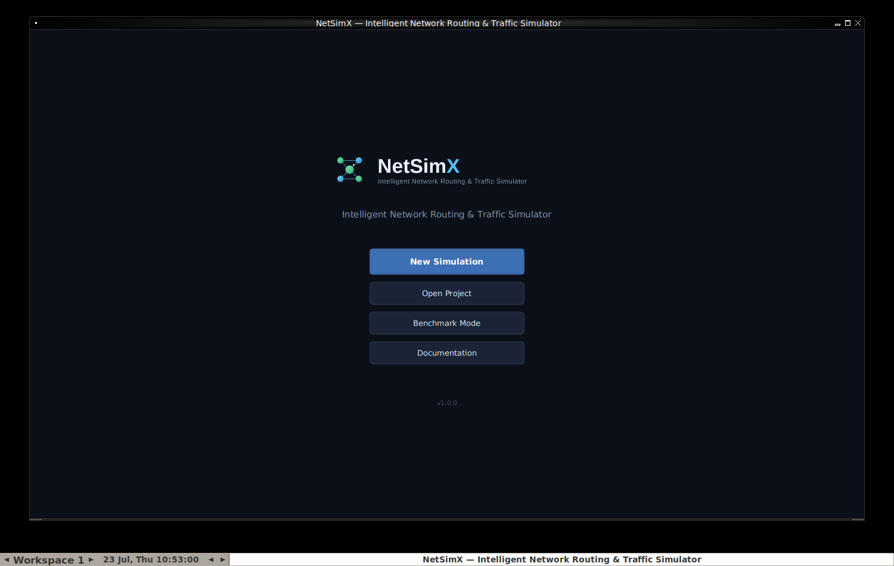
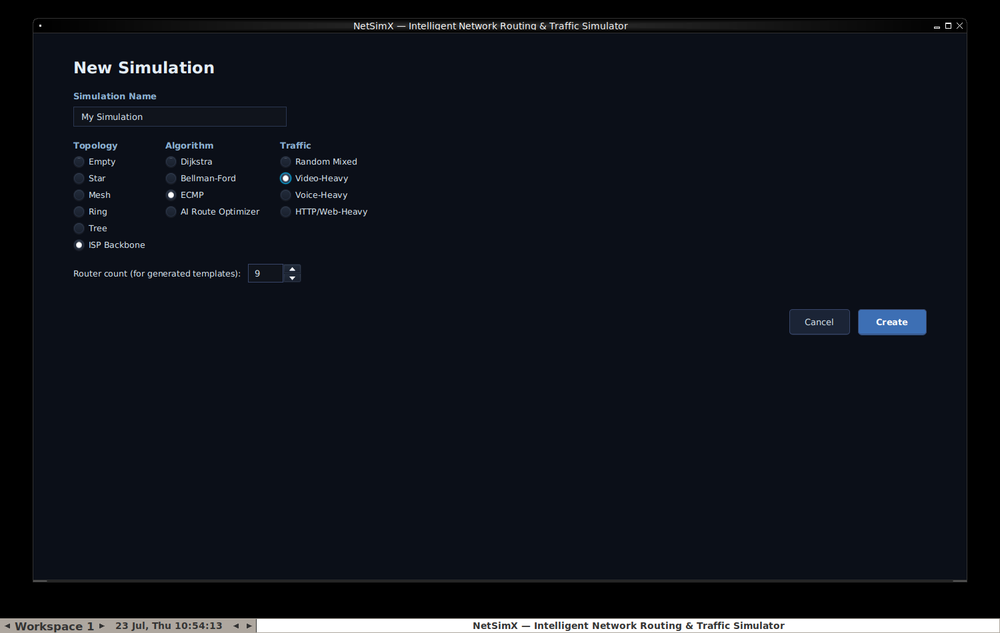
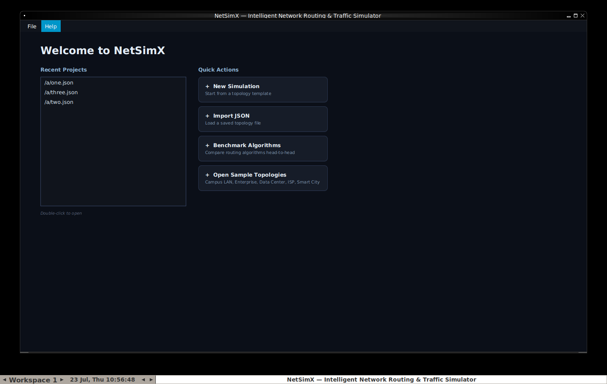
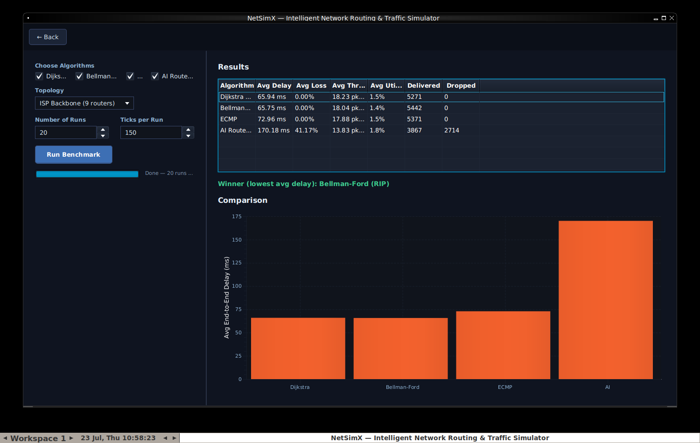
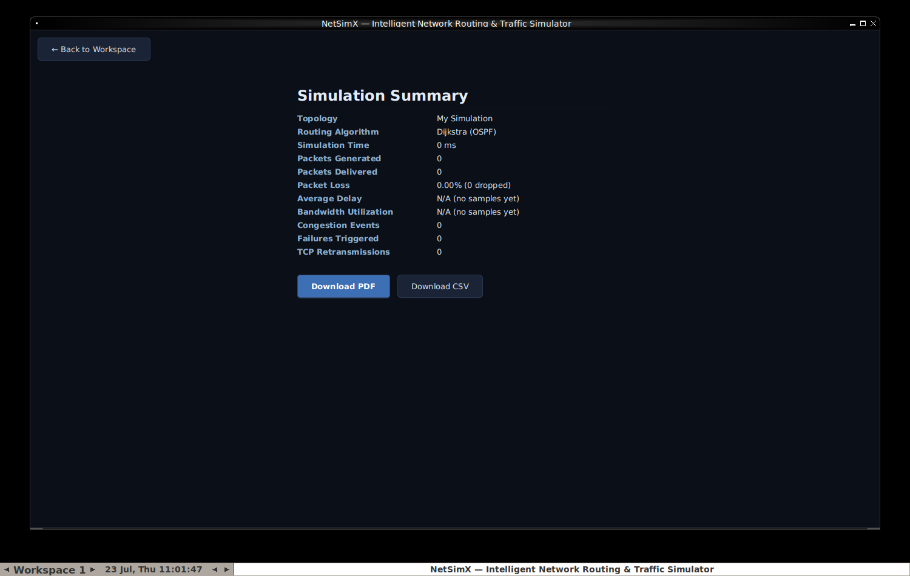

# NetSimX — Complete Project Documentation

### From idea to working application: what it is, why every piece exists, how it was built, and how to build something bigger on top of it.

---

## How to use this document

This is written for someone who is picking up NetSimX for the first time
— maybe you're inheriting this codebase, maybe you found it and want to
extend it, maybe you're just curious how a project like this comes
together. No prior knowledge of the project is assumed. Networking
concepts (routers, packets, TTL, QoS) are explained in plain language the
first time they appear, and there's a glossary at the end if you need a
quick refresher later.

If you only read one section, read **"How the simulation actually
works"** — everything else in the codebase exists to serve that one loop.

---

## 1. Origin story — why this project exists

NetSimX started from a written proposal for a **Java-based Intelligent
Network Routing and Traffic Simulator**. The core problem it set out to
solve was simple to state: computer networks are everywhere, but most
people never get to *see* how a router actually decides where to send a
packet, what happens when a link dies mid-transfer, or why a video call
gets choppy while a file download in the background keeps chugging along
fine. Real networking hardware is expensive and inconvenient to
experiment on; existing teaching simulators tend to be either too
simplistic (a static diagram with arrows) or too opaque (a black box that
gives you a final number with no visibility into *why*).

The original proposal's objectives, almost word for word, were to build a
system that could:

- Model a graph-based computer network (routers + links) that the user
  builds themselves.
- Actually move packets hop-by-hop and show that movement happening.
- Implement multiple real routing algorithms and let you compare them.
- Simulate the messy realities of real networks: congestion, buffer
  overflow, packet loss, link/router failures.
- Model the difference between TCP (reliable, acknowledged, retried) and
  UDP (fire-and-forget) at the packet level.
- Support Quality-of-Service prioritization (a voice call packet should
  jump the queue ahead of a background file transfer).
- Recover automatically when part of the network goes down.
- Optionally use AI/reinforcement learning to make smarter routing
  decisions than a fixed algorithm can.
- Present all of this through a real, interactive graphical dashboard —
  not a command-line log of numbers.

That proposal is the reason every module described later in this
document exists. Nothing here was designed in the abstract; every class
maps back to one of those original goals.

---

## 2. Technology choices, and why

**Java 17 + JavaFX.** The proposal specifically called for a Java-based
simulator with a real GUI. JavaFX is the modern, actively-maintained
GUI toolkit for Java (Swing's successor), and it comes with everything
this project needed out of the box: a `Canvas` for drawing the network
topology and animating packets, charts for live graphs, and standard
controls (buttons, tables, tabs, dialogs) for everything else. Java 21
was the original target, but partway through development we discovered
the code didn't actually use any Java-21-only language features — it was
lowered to **Java 17** so it would run on more machines without forcing
an unnecessary JDK upgrade. (See section 6 for the story of *why* that
mattered.)

**Maven**, for anyone who hasn't used it: it's a build tool. You describe
your project's dependencies (in this case, JavaFX and a testing library
called JUnit) in one file, `pom.xml`, and Maven downloads them and knows
how to compile, test, and package your code with one command each —
`mvn compile`, `mvn test`, `mvn package`. You don't manually download
JavaFX `.jar` files and wire them together by hand.

**Almost no external dependencies.** Beyond JavaFX (the GUI) and JUnit
(testing, and only needed to *run tests* — not to run the app itself),
NetSimX deliberately avoids pulling in extra libraries. Where a typical
project would reach for a JSON library, a PDF library, or a database
driver, this one has small hand-written replacements instead
(`MiniJson`, `MiniPdf`, and flat-file persistence instead of SQLite).
This was a conscious trade-off, explained fully in section 8 — the short
version is: fewer dependencies means fewer things that can break when
someone else tries to build this project years from now with whatever
Java tooling exists at the time.

---

## 3. The project structure, file by file

This section is the long one — it walks through every folder and every
source file, in the order you'd naturally read them if you were exploring
the codebase from scratch. Skip ahead to section 5 if you want the "how
does it actually run" story first and want to come back to the file
tour later.

```
netsimx/
├── pom.xml                        — the build recipe (Maven)
├── .github/workflows/ci.yml       — automatic build+test on every push
├── config/
│   ├── sample-network.json        — the network loaded when the app starts in demo mode
│   └── samples/                   — a small library of ready-made networks
├── docs/                          — this file, plus generated images
└── src/
    ├── main/java/com/netsimx/     — all application source code
    └── test/java/com/netsimx/     — all automated tests
```

### 3.1 `pom.xml`

The build file. Declares: the project is Java 17, it depends on JavaFX
21 (controls, graphics, base) and JUnit 5 for tests, and it has two build
plugins wired up — `javafx-maven-plugin` (so `mvn javafx:run` launches
the app correctly with JavaFX on the module path) and `maven-shade-plugin`
(so `mvn package` produces one self-contained runnable `.jar`).

### 3.2 `com.netsimx.model` — the nouns of the simulation

This package defines the *things* that exist in a simulated network. No
behavior lives here beyond simple bookkeeping — these are data classes
that everything else operates on.

- **`Router.java`** — a single network node. Holds an ID (`"R1"`), a
  human-readable label (`"Core-1"`), an x/y position (for drawing it on
  the canvas), an up/down status, and — importantly — a **bounded queue**
  of packets waiting to be forwarded. That queue has a fixed capacity;
  if it fills up, new packets get dropped. This one detail is what makes
  "congestion" a real, emergent thing in this simulator rather than a
  number someone made up: if packets arrive faster than a router can
  send them onward, the queue fills, and packets genuinely start getting
  lost, exactly like a real router.

- **`Link.java`** — a connection between two routers. Has a *cost*
  (used by routing algorithms to pick the "cheapest" path), a *latency*
  in milliseconds, and a *bandwidth* in packets/second (how many packets
  it can carry per simulation tick). Also has two features added later
  in development for the interactive dashboard: `lossProbability` (an
  independent chance a packet is lost in transit, separate from
  congestion — simulating a noisy or damaged cable) and `congest()` /
  `releaseCongestion()` (lets you manually throttle a link's bandwidth
  from the UI to demonstrate backpressure on demand).

- **`Packet.java`** — a single unit of data traveling through the
  network. Carries a source, a destination, a size in bytes, a
  **TTL** (Time To Live — a countdown that decrements every hop; if it
  hits zero before arriving, the packet is discarded, which is exactly
  how real IP networks prevent packets from looping forever), a
  priority class, and a protocol (TCP or UDP). Also computes a checksum
  for display purposes (see section 8 for an honest note on what that
  does and doesn't mean here).

- **`PacketPriority.java`** — an enum: `VOICE`, `VIDEO`, `WEB`, `EMAIL`,
  `FILE_TRANSFER`, in that priority order. This ordering is what the QoS
  scheduler uses to decide which packet gets sent first when a router
  can't send everything at once.

- **`Protocol.java`** — just `TCP` or `UDP`. The *behavior* difference
  between them (retries, acknowledgements) is NOT here — it lives in
  `simulation.TcpUdpManager`. This enum is just the label.

- **`NetworkTopology.java`** — the container that holds all the routers
  and links for one network, plus fast lookups (which links touch this
  router? which neighbors are currently reachable?). Every other part of
  the app reads/writes this class rather than routers and links directly.

### 3.3 `com.netsimx.routing` — how a packet decides where to go next

- **`RoutingAlgorithm.java`** — an interface. Anything that can compute
  "given a source router, what's the best path to every other router?"
  implements this. This is the seam that makes it possible to swap
  algorithms live in the dashboard without touching anything else.

- **`DijkstraRouting.java`** — Dijkstra's algorithm, the textbook
  shortest-path algorithm, modeling **OSPF** (a real-world routing
  protocol used inside large networks). Every router is assumed to know
  the entire network map and picks the mathematically cheapest path.

- **`BellmanFordRouting.java`** — a different shortest-path algorithm,
  modeling **RIP** (another real protocol). Unlike Dijkstra, it doesn't
  need full network visibility up front — it converges by routers
  gossiping distances to their neighbors. For a *static* topology
  snapshot, it produces the same answer as Dijkstra (there's a test that
  checks exactly this — `dijkstraAndBellmanFordAgreeOnCost`), but it
  represents a genuinely different real-world approach.

- **`ECMPRouting.java`** — Equal-Cost Multi-Path routing. When there are
  multiple paths of the *exact same* cost between two points, this
  spreads traffic across all of them round-robin, instead of always
  picking one. This is what makes "load balancing" (module 9 of the
  original proposal) real rather than cosmetic — it recomputes live,
  per-packet, so two packets sent moments apart between the same routers
  can genuinely take different physical paths.

- **`RoutingTable.java`** — caches the routes computed by whichever
  algorithm is active, and knows when to recompute them (any time the
  topology changes — a link fails, a router is added, etc.). This is
  also what powers the Routing Table inspector panel in the dashboard.

### 3.4 `com.netsimx.simulation` — the engine room

This is the biggest and most important package. Everything here works
together once per **tick** (one simulated time-step) to move the whole
network forward. `SimulationEngine.java` is the conductor; everything
else in this package is an instrument it plays.

- **`SimulationEngine.java`** — owns the main loop. Every call to
  `tick()` does five things in order: maybe inject a random failure (if
  chaos mode is on), generate new traffic, check for TCP timeouts,
  forward every router's queued packets one hop, and record statistics.
  Section 5 walks through this in full detail.

- **`TrafficGenerator.java`** — creates new packets. Modeled on five
  realistic traffic *profiles* (Voice, Video, Web, Email, File Transfer),
  each with a believable packet size range, priority, and protocol — for
  instance, Voice traffic is small, frequent, high-priority, and UDP
  (real VoIP works this way: a late voice packet is useless, so nobody
  bothers retransmitting it), while File Transfer is large, low-priority,
  and TCP (correctness matters more than speed).

- **`QoSScheduler.java`** — when a router has more packets ready to send
  than its outgoing link can carry this tick, this class decides which
  ones go first, in strict priority order (Voice, then Video, then Web,
  then Email, then File Transfer). This is what makes "Quality of
  Service" a real, visible effect instead of a checkbox.

- **`CongestionController.java`** — converts a link's configured
  bandwidth into "how many packets can actually cross this link this
  tick," and tracks a rolling utilization percentage that decays when
  the link is idle. This is what drives the utilization numbers and
  colors you see on the dashboard.

- **`QueueManager.java`** — tracks each router's queue occupancy over
  time (high-water marks, current congestion state) and, since the
  Benchmark/Report work, counts distinct **congestion episodes** — a
  50-tick traffic jam counts as *one* event, not fifty, because it only
  counts the moment a router transitions from "not congested" to
  "congested," not every tick spent congested.

- **`FailureSimulator.java`** — the module responsible for taking links
  or routers down (manually, via right-click, or automatically in
  "chaos mode"), and bringing them back up. Also counts total failure
  events for the Report screen.

- **`TcpUdpManager.java`** — models the real behavioral difference
  between TCP and UDP. UDP packets are genuinely fire-and-forget — no
  code here touches them at all. TCP packets are tracked from the moment
  they're sent: if one is dropped, or its acknowledgement doesn't arrive
  within a timeout window, it gets automatically retransmitted, up to a
  configurable maximum number of attempts before the "connection" gives
  up. **This file had two real bugs found and fixed during development
  — see section 7, it's worth reading if you're curious what that
  process actually looked like.**

- **`BenchmarkRunner.java`** — added for Benchmark Mode. Runs a given
  topology/traffic scenario **headlessly** (no GUI, no waiting for real
  time to pass — `tick()` is just called thousands of times back to
  back as fast as the CPU allows) once per algorithm, multiple times
  each, and averages the results so different routing algorithms can be
  compared fairly under identical conditions.

### 3.5 `com.netsimx.ai` — the adaptive route optimizer

- **`QLearningRouteOptimizer.java`** — a genuine, working
  **reinforcement learning** agent, implemented from scratch in plain
  Java (no external ML library). If you haven't encountered Q-learning
  before: the agent maintains a table of "how good is it, roughly, to go
  from router X toward destination Y by way of neighbor Z" — and every
  time it actually tries a hop, it observes what happened (was the link
  congested? was there packet loss?) and nudges that table's value up or
  down. Given enough training, it learns to route around congestion
  *without being told the rules of routing at all* — it just learns from
  experience. It implements the exact same `RoutingAlgorithm` interface
  as Dijkstra/Bellman-Ford/ECMP, so the dashboard can swap it in exactly
  the same way. See section 8 for why this is pure Java instead of the
  Python + Stable-Baselines3 originally proposed.

### 3.6 `com.netsimx.analytics` — turning raw numbers into a story

- **`StatisticsCollector.java`** — every tick, records what happened
  (packets generated/delivered/dropped) and periodically produces a
  **`PerformanceSnapshot`** — a single point-in-time bundle of throughput,
  average delay, packet delivery ratio, loss rate, and utilization. This
  is what feeds the live charts.

- **`PerformanceSnapshot.java`** — just the data bundle described above,
  plus a method to format itself as one row of a CSV file.

### 3.7 `com.netsimx.persistence` — saving and loading things

Every file in this package deliberately avoids external libraries — see
section 8 for the reasoning.

- **`MiniJson.java`** — a small, complete JSON reader and writer, written
  by hand. Used to save/load network topologies as `.json` files.

- **`TopologyIO.java`** — uses `MiniJson` to convert a `NetworkTopology`
  to and from a JSON file on disk. This is what powers Load JSON / Save
  JSON in the dashboard.

- **`CsvExporter.java`** — dumps the collected performance history to a
  `.csv` file, so you can open it in Excel or analyze it with any other
  tool that reads CSV.

- **`MiniPdf.java`** — a hand-written PDF file generator. Yes, really —
  PDF is a plain-text-ish format underneath, and for a document that's
  just a title and some lines of text, you can generate a fully valid
  PDF without any library at all. This is what the Report screen's
  "Download PDF" button uses. It was tested by generating a PDF and then
  extracting its text back out with an external tool (`pdftotext`) to
  confirm real PDF readers can actually open it correctly.

- **`RecentProjects.java`** — remembers which topology files you've
  recently opened, saved to a small file in your home folder
  (`~/.netsimx/recent-projects.json`), so the Home Dashboard's "Recent
  Projects" list survives between runs of the app.

### 3.8 `com.netsimx.topology` — building networks automatically

- **`TopologyGenerator.java`** — added for the New Simulation Wizard.
  Instead of forcing you to place every router and link by hand, this
  class can generate a **Star** (one hub, many spokes), **Mesh** (every
  router connects to every other router), **Ring** (a closed loop),
  **Tree** (a branching hierarchy), or the same **ISP Backbone** shape
  as the bundled sample network — all with sensible default costs and
  positions so they look reasonable the moment they appear on screen.

### 3.9 `com.netsimx.gui` — everything you actually see and click

This package is deliberately organized as one class per screen or panel,
so each piece can be understood (and modified) on its own.

- **`NetSimXApp.java`** — the application's entry point and traffic
  cop. Owns the single window (`Stage`) and the single `Scene`; every
  screen swap (Splash → Wizard → Workspace → Benchmark → Report → back)
  is just swapping what's inside that one `Scene`. Also owns the two
  "clocks" that make the simulation move: a `Timeline` that calls
  `engine.tick()` on a fixed schedule, and an `AnimationTimer` that
  smoothly interpolates packet dots between ticks so motion looks fluid
  instead of jumping from router to router.

- **`Launcher.java`** — a tiny, almost-empty class that exists to work
  around one specific Java quirk: if you package a JavaFX app into one
  runnable jar and that jar's main class directly extends
  `javafx.application.Application`, plain `java -jar yourapp.jar` fails
  with "JavaFX runtime components are missing" — Java refuses to start
  it that way. Routing through this indirection class (which does *not*
  extend `Application`, it just calls `NetSimXApp.main()`) sidesteps that
  check entirely. This is a well-known pattern, not something specific
  to this project, but it's exactly the kind of thing that quietly
  breaks a project for anyone who downloads it and tries `java -jar`
  without knowing the trick.

- **`SplashScreen.java`** — the very first thing you see. Four buttons:
  New Simulation, Open Project, Benchmark Mode, Documentation.

  

- **`NewSimulationWizard.java`** — the form you fill out to start a new
  simulation: a name, a topology template, a starting algorithm, and a
  traffic preset.

  

- **`HomeDashboard.java`** — a lighter-weight landing page reachable
  from inside the workspace (the 🏠 Home button): recent projects and
  quick actions.

  

- **`TopologyCanvas.java`** — the heart of the visual experience. A raw
  JavaFX `Canvas` (meaning: nothing is a pre-built UI widget here,
  everything — routers, links, animated packets — is hand-drawn with
  drawing commands like "fill this circle," "stroke this line"). Also
  handles all mouse interaction: dragging routers, clicking to select a
  router/link/packet, right-clicking for a context menu.

- **`ControlPanel.java`** — the left-hand sidebar: simulation
  start/pause/step/reset, algorithm selector, tick speed, topology
  editing tools, traffic generator controls, failure/chaos controls.

- **`NetworkPanel.java`**, **`PacketInspectorPanel.java`**,
  **`RoutingTablePanel.java`** — the three "inspector" tabs on the
  right. Click a router to see its live status/queue/neighbors in
  `NetworkPanel`, or its live routing table in `RoutingTablePanel`.
  Click any moving packet dot on the canvas to see its full live detail
  — source, destination, TTL, current router, delay, and more — in
  `PacketInspectorPanel`.

  

- **`ChartsPanel.java`** — four live line charts (throughput, delay,
  packet delivery ratio, utilization), fed a new data point every tick.

- **`LogConsole.java`** — a scrolling text log of everything notable
  that happens: drops, retransmissions, failures, recoveries.

  

  

- **`BenchmarkScreen.java`** — pick which algorithms to compare, how
  many runs, and how long each run is, then get a results table and a
  bar chart.

  

- **`ReportScreen.java`** — a plain-language summary of the current
  simulation session, with Download PDF / Download CSV buttons.

  

### 3.10 `config/` — starter data

- **`sample-network.json`** — the 9-router "Campus LAN" network loaded
  automatically in demo/recording mode.
- **`samples/`** — five ready-made networks (Campus LAN, Enterprise
  Network, Data Center, ISP Backbone, Smart City IoT) offered in the
  Home Dashboard and wizard, some hand-built and some generated with
  `TopologyGenerator` and saved out to JSON.

### 3.11 `src/test/java` — the automated safety net

Every package above that has real logic (not just UI) has a matching
JUnit 5 test class: `RoutingAlgorithmsTest`, `SimulationEngineTest`,
`LinkMechanicsTest`, `TcpUdpManagerTest`, `TopologyGeneratorTest`,
`BenchmarkRunnerTest`, `RecentProjectsTest`, `MiniPdfTest` — **38 tests
in total**, all passing, run automatically on every push via the GitHub
Actions workflow in `.github/workflows/ci.yml`. `ManualSmokeCheck.java`
is a separate, simpler end-to-end check you can run directly with `java`
without needing Maven or JUnit at all — useful as a fast sanity check.

### 3.12 `docs/` — this document and its images

`docs/assets/` holds the logo (SVG source + generated PNGs), the
architecture diagram (generated from a small Python script,
`gen_architecture_diagram.py`, so it can be regenerated if the package
structure changes), the demo GIF, and every screenshot referenced in
this document and the README — all captured from the actual running
application, not mocked up.

---

## 4. Architecture, visually


Every arrow in that diagram is a real dependency in the source code —
`simulation` depends on `model`, `routing`, and `ai`; `gui` depends on
all of them plus `analytics` and `persistence`; nothing depends on `gui`
(the simulation engine has no idea a graphical interface even exists,
which is exactly what makes `BenchmarkRunner` able to run the same
engine headlessly, with zero GUI overhead).

---

## 5. How the simulation actually works

This is the one section to read carefully if you want to really
understand the project. Everything else is scaffolding around this loop.

Once a simulation is running, `SimulationEngine.tick()` fires on a
timer (by default every 100 simulated milliseconds) and does exactly
five things, in this order, every single time:

**1. Maybe break something.** If "chaos mode" is switched on, there's a
small random chance a link gets taken down this tick — this is what
turns failure-recovery from a manual demo into an ongoing stress test.

**2. Make new packets.** Every configured traffic flow (e.g. "send Video
traffic from Router A to Router C") rolls the dice this tick based on
its configured rate; if it "hits," a new `Packet` is created, a route is
computed for it (using whichever routing algorithm is currently active),
and it's placed in its source router's outgoing queue. If no route
exists (the destination is unreachable), it's dropped immediately and
that's recorded as a loss.

**3. Check for stuck TCP packets.** Any TCP packet that's been waiting
too long for its acknowledgement gets automatically resent.

**4. Move everything one hop.** This is the busiest step. For every
router that has packets waiting: figure out how many packets it's
physically allowed to send this tick (based on its outgoing links'
bandwidth), let the QoS scheduler pick which ones go first (Voice before
Video before Web before Email before File Transfer), and for each chosen
packet: check for random line-error loss, decrement its TTL, and either
deliver it (if it just reached its destination — which, for a TCP
packet, also triggers an automatic acknowledgement packet heading back
the other way), drop it (buffer overflow at the next router, a dead
link, or TTL hitting zero), or leave it queued for next tick if the
link is already full this tick.

**5. Take a snapshot.** Queue occupancy and a full performance snapshot
(throughput, delay, loss rate, utilization) are recorded, which is what
feeds the live charts and the eventual Report screen.

That's the entire simulation. Every visible feature in the dashboard —
the animated dots, the color-coded congestion, the routing table
updating after a failure, the AI slowly getting better at avoiding
traffic jams — is just a different *view* onto this one loop running
over and over.

---

## 6. The development journey

This section is a chronological account of how the project actually got
built, in the order the work happened, including the mistakes and the
fixes — because that's usually the most useful part of a "how was this
built" document for someone trying to learn from it.

**Phase 0 — the initial build.** Starting from the original written
proposal, the whole application was scaffolded in one pass: the Maven
project, every model/routing/simulation/ai/analytics/persistence class,
and a first version of the JavaFX dashboard, all compiled, unit-tested,
and actually launched (screenshotted, not just "should work") before
being handed off. The AI module and the persistence layer were both
adapted from the original proposal at this stage (see section 8) because
the intended external tools (Python's Stable-Baselines3, SQLite) weren't
realistically integrable in the way the project needed.

**Fixing "why won't it even run."** The first real obstacle wasn't a bug
in the app at all — it was getting Java and Maven properly installed and
on the system PATH on a Windows machine, plus discovering the project
had been set to require Java 21 when it didn't actually use anything
Java 21-specific, so it was lowered to Java 17 to remove an unnecessary
barrier to entry.

**"The window isn't adjusted properly."** Early on, the app's window
could open partially off-screen depending on the user's monitor setup,
because its size and position were hardcoded. Fixed by querying the
actual screen's usable area at startup and sizing/centering the window
against *that*, instead of assuming a fixed resolution — verified by
testing the fix on a deliberately small virtual screen, not just the
original one.

**Building out the professional presentation.** A big push to make the
project look and read like a real, polished open-source project: a
proper README with badges, a hand-designed logo (as an SVG, then
rendered to PNG), a real architecture diagram generated from a small
script (not drawn by hand, so it can be regenerated if the code
structure changes), a scripted "demo mode" (`-Dnetsimx.demo=true`) that
reliably drives the app through a realistic scenario for recording
screenshots and a GIF, and a GitHub Actions workflow so the "build
passing" badge means something real. **While doing this, testing the
"download and run the packaged jar" instructions turned up a genuine
bug** — the classic "JavaFX runtime components are missing" failure
described in section 3.9 — which is exactly why `Launcher.java` exists.

**Inspector panels and context menus.** The dashboard gained three new
"click something to inspect it" panels (Network, Packet Inspector,
Routing Table) and full right-click context menus on routers and links.
Verifying this phase surfaced an interesting environment problem, not an
app problem: JavaFX right-click menus render as separate pop-up windows,
and the headless testing environment used during development didn't
have a window manager running, which silently broke how those pop-ups
displayed — installing a minimal window manager for testing (not
changing anything in the app itself) resolved it, and the underlying
context-menu code turned out to have been correct all along.

**App navigation.** The Splash → Dashboard → Wizard → Workspace flow
described in section 3.9 was added, along with procedural topology
generators and a small library of sample networks.

**Benchmark Mode and Reports.** The headless multi-run benchmark
comparison and the PDF/CSV report export were added last. Building the
benchmark runner — which exercises long-running TCP sessions far harder
than a few minutes of clicking around the dashboard ever would — is what
surfaced **two real, previously-shipping bugs** in the TCP retry logic.
Both are documented in full in the next section, because how they were
found is arguably more instructive than the bugs themselves.

---

## 7. Bugs found and fixed (a debugging case study)

Two genuine bugs were found in `TcpUdpManager` while stress-testing the
new benchmark runner. Neither was visible during normal interactive use
of the dashboard — both needed a TCP flow to run long enough, with
enough simultaneous activity, to hit an edge case that a few minutes of
manual clicking around just doesn't reliably trigger. This is a good
illustration of *why* automated, high-volume testing matters even for a
project that already "seems to work fine."

**Bug 1 — a crash.** `TcpUdpManager.checkTimeouts()` loops over a list
of "packets currently waiting for an acknowledgement" to find any that
have waited too long. For each one it finds, it needs to create a
retransmission and add *that* to the same waiting-list. The original
code did this addition **while still looping over the list** — which
Java explicitly forbids and throws a `ConcurrentModificationException`
for, precisely because modifying a collection while iterating it can
silently corrupt the iteration in ways that are much worse than a clean
crash. It only happened when *two or more* packets happened to time out
in the exact same tick — rare enough in casual use, but the benchmark
runner hits it constantly. Fixed by collecting all the needed changes
during the loop, then applying them all *after* the loop finishes.

**Bug 2 — a silent correctness bug, which is arguably worse than a
crash because nothing tells you it's wrong.** Every TCP packet is
supposed to give up and stop retrying after a configurable maximum
number of attempts. The retry-counting logic itself was correct — but
completely separately, every time *any* packet (fresh or a retry) gets
handed to the network, a different, unrelated method
(`onTcpPacketSent`) unconditionally resets that packet's attempt count
back to 1. Since every retransmitted packet naturally *does* get handed
back to the network as part of normal delivery, its carefully
incremented attempt count was being silently wiped every single time —
meaning the "give up after N attempts" limit never actually did
anything; a sufficiently unlucky TCP flow could, in principle, retry
forever. The fix was a one-word change — using `putIfAbsent` instead of
`put`, so a retry's already-correct attempt count is preserved instead
of overwritten — but finding it required writing a test that simulated
the *real* sequence of calls the engine actually makes, not just calling
the class's methods in isolation. Both fixes now have permanent
regression tests (`TcpUdpManagerTest`) so neither can silently come back.

---

## 8. Design decisions and honest trade-offs

Every project accumulates places where the "correct" or "ideal"
implementation wasn't practical, and a reasonable substitute was used
instead. Being upfront about these is more useful to someone extending
this project than pretending they don't exist.

**The AI route optimizer is pure Java, not Python + Stable-Baselines3.**
The original proposal listed Python's Stable-Baselines3 (a real,
popular reinforcement-learning library) as the AI backend. Wiring a
Java desktop app up to a separate Python process is a reasonable thing
to do in production, but it adds a lot of moving parts (process
management, a communication protocol between the two languages, Python
environment setup) that don't serve a first version well. Instead,
`QLearningRouteOptimizer` is a real, working Q-learning implementation,
just written directly in Java with no external ML framework. It
implements the same `RoutingAlgorithm` interface every other algorithm
does — so if you *do* want to swap in a real Python/Stable-Baselines3
service later, you'd replace this one class with an HTTP or gRPC client
and nothing else in the project would need to change.

**No SQLite.** The original tech stack included SQLite for persistence.
Everything this project actually needs to persist — network topologies,
performance history, a short list of recently-opened files — is small
and naturally shaped as either a JSON document or a flat table, so
hand-rolled `MiniJson`/CSV/flat-file persistence covers it without
pulling in a database driver. If you extend this project with something
that genuinely needs relational queries or concurrent multi-user access,
that's exactly the point where reaching for a real database (SQLite or
otherwise) would start to pay for itself.

**No PDF library.** `MiniPdf` hand-generates simple, valid PDF files
using nothing but the standard non-embedded Helvetica font and plain
text layout. This works well for a text report; it would not be the
right tool if you wanted embedded charts, images, or complex layout in
your PDFs — at that point, a real library (Apache PDFBox is the common
choice in the Java world) is the right call.

**Benchmark Mode compares "Avg Utilization" and delivered/dropped
counts, not "CPU/Memory."** The original proposal's benchmark table
included CPU and memory columns. Those make sense for comparing, say,
two different physical servers — but this simulator doesn't model
router hardware at all, so a "CPU usage" number would have had to be
fabricated rather than measured. The columns were swapped for metrics
the engine genuinely tracks instead.

**The packet "checksum" is real but always valid.** `Packet.
computeChecksum()` really does compute a value from the packet's
contents, but there's currently no mechanism in the simulator that ever
corrupts a packet's payload — drops model congestion, TTL expiry, and
link failure, not bit-level corruption — so the checksum will always
come back valid. It's an honest placeholder for exactly the kind of
feature ("simulate an unreliable link corrupting data") someone
extending this project could add.

---

## 9. How to extend this project

Some concrete starting points, roughly ordered from smallest to
largest:

- **A new traffic type.** Add a case to `TrafficGenerator.TrafficType`
  with its own size range, priority, and protocol. Nothing else needs to
  change — the QoS scheduler, statistics, and UI all already work
  generically across whatever priorities exist.

- **A new routing algorithm.** Implement `RoutingAlgorithm` (one method:
  given a topology and a source router, return the best path to every
  other router). Drop it into the algorithm dropdown in `ControlPanel`
  and the Benchmark Mode checklist in `BenchmarkScreen`, and it's fully
  usable everywhere else in the app with no other changes — this is the
  entire reason that interface exists.

- **A new topology template.** Add a case to
  `TopologyGenerator.Template` and a matching private generator method.
  It'll show up automatically in the New Simulation Wizard's radio
  button list.

- **Real packet corruption.** Give `Packet` a "corrupted" flag, have
  `SimulationEngine` roll a chance to set it alongside the existing
  `Link.lossProbability` check, and make `computeChecksum()`/
  `isChecksumValid()` actually reflect it. The Packet Inspector panel
  already has a field ready to display the result.

- **BGP / MPLS / IPv6 / SDN.** All explicitly out of scope for this
  version (per the original proposal's own "Future Scope" section), and
  all genuinely large undertakings — but the modular structure (a
  routing algorithm is just a class implementing one interface; a new
  protocol is just a new enum value plus behavior in `TcpUdpManager` or
  a sibling class) is deliberately set up so none of them would require
  rewriting the simulation core.

- **Real database persistence.** If you outgrow flat-file JSON/CSV —
  say, you want a shared server tracking many users' simulations —
  `persistence.TopologyIO` and `persistence.CsvExporter` are the two
  places to swap out; everything upstream of them (the GUI, the engine)
  doesn't know or care how persistence is implemented.

- **A headless/server mode.** `BenchmarkRunner` already proves the
  simulation engine runs perfectly well with zero GUI involvement. A
  command-line tool, a web API, or a batch-processing service built on
  top of `SimulationEngine` directly (skipping the `gui` package
  entirely) is very achievable without touching the engine at all.

---

## 10. Glossary

**Router** — a node in the network that receives packets and forwards
them toward their destination.

**Link** — a connection between two routers, with a cost, latency, and
bandwidth.

**Packet** — one unit of data moving through the network, hop by hop.

**TTL (Time To Live)** — a countdown carried by every packet, reduced by
one at every hop; if it reaches zero before the packet arrives, the
packet is discarded. Prevents packets from circulating forever if
something goes wrong with routing.

**Routing algorithm** — the method used to decide the best path from
one router to another. See section 3.3 for the four implemented here.

**Congestion** — what happens when packets arrive at a router faster
than it can send them onward; its queue fills up and new arrivals start
being dropped.

**QoS (Quality of Service)** — prioritizing some traffic over other
traffic when a network is too busy to send everything at once (e.g.
sending a voice call's packets before a file download's).

**TCP vs UDP** — two different sets of rules for sending data. TCP
guarantees delivery (missing packets are automatically resent) at the
cost of extra overhead and complexity; UDP just sends and doesn't check
whether it arrived, which is faster and simpler but can lose data
silently. Real-world voice/video calls typically use UDP (a late packet
is useless anyway); file transfers and web pages typically use TCP
(correctness matters more than speed).

**ACK (Acknowledgement)** — a small packet TCP sends back confirming
"I received that," which is how TCP knows when to give up waiting and
resend something.

**ECMP (Equal-Cost Multi-Path)** — spreading traffic across multiple
equally-good paths instead of always using just one, to use available
capacity more evenly.

**Reinforcement learning / Q-learning** — a machine learning approach
where an agent learns good decisions purely through trial and error and
observed outcomes, without being explicitly programmed with the rules —
see section 3.5.

---

## 11. Closing notes

Every screenshot in this document, and every specific number quoted in
section 6 and 7, was captured from the actual running application during
development, not written from memory or assumption — where this document
describes something as verified, it means an automated screenshot was
taken, the relevant text or colors were checked programmatically, and
only then was it written up here. If you're extending this project,
that habit — actually running the thing and checking the real output,
rather than trusting that code "should" work — is probably the single
most valuable thing to carry forward.

Good luck with wherever you take this next.
